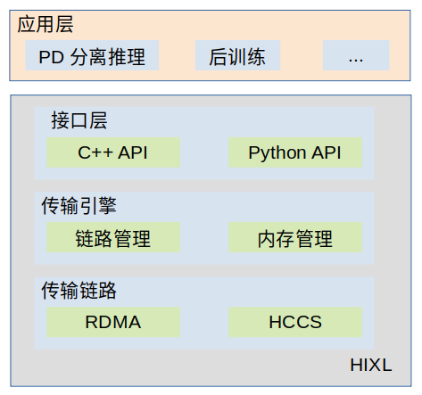

# HIXL

## 🔥Latest News

- [2025/10] HIXL项目开源。
- [2025/09] 支持接入Mooncake和DeepLink开源社区。
- [2025/08] 支持小数据量批量传输场景的合并传输优化。
- [2025/07] HIXL支持昇腾芯片的多链路D2D/D2H/H2D/H2H高效的单边通信能力。

## 🚀概述
HIXL（Huawei Xfer Library）是一个灵活、高效的昇腾单边通信库，面向集群场景提供简单、可靠、高效的点对点数据传输能力，并通过简易API开放给用户, 在多AI应用和多传输链路之间建立了桥梁。可用于构建大模型PD分离、RL后训练参数切换、模型参数缓存等多种业务场景。

**核心优势**
- **支持单边零拷贝（One-Sided Zero-Copy）通信机制**：HIXL提供简易、可靠的单边通信接口，可在本地内存数据准备就绪之后，通过单边操作完成向远端内存的直接数据传输。该机制无需远端节点执行任何操作，为用户构建通信与计算重叠掩盖的调度机制提供核心技术支撑。同时，零拷贝能力实现用户内存间的直接数据传输，避免冗余数据搬运，不仅可以降低内存带宽占用，还可以减少内存容量消耗。
- **屏蔽硬件差异，兼容多链路实现跨设备高速互联**：HIXL屏蔽了昇腾系列芯片的底层硬件差异，用户无需针对不同芯片架构进行代码适配。在通信链路层面，该技术原生支持RDMA，HCCS等多种高速互联协议，通信带宽最高可达120GB/s，可实现跨架构设备（如A2系列与A3系列昇腾芯片）的无缝高速互联，满足低时延、 高吞吐的需求。
- **极简API设计，深度适配开源生态框架**：HIXL采用极简式API接口设计，接口数量精简至10余个核心调用，降低开发者集成门槛，同时提供完善的C++/Python语言接口支持。目前已实现与Mooncake、DeepLink等开源框架的深度集成，vLLM、SGLang等主流推理引擎也可以直接调用HIXL API完成KV Cache的跨设备高效传输，将大模型推理过程中的内存访问延迟降低20%，显著提升推理吞吐




**核心组件**

- **HIXL**：作为核心传输引擎，提供了基础传输接口，支持多种类型内存类型传输，比如D2D、D2H、H2D以及H2H。同时兼容多种传输协议，包括HCCS、RDMA等。可实现高速、可靠的数据传输。原生支持多类型数据链路，可灵活同构集群、异构集群的复杂场景。面对集群节点动态扩缩容需求时，可快速完成链路适配与资源调度，为集群整体运行构建可靠通信基础。
- **LLM-DataDist**：基于HIXL构建，提供了一套携带KV Cache语义的数据传输接口。可快速、灵活对接vLLM、SGLang等主流推理引擎。


**性能表现**

在昇腾A3芯片上传输128M数据场景下：
- 通过HCCS链路进行传输，HIXL传输引擎的带宽可达119G/s
- 通过RDMA链路进行传输，HIXL传输引擎的带宽可达22G/s
（补充一张图）

## 🔍目录结构

```
├── build.sh                       # 项目工程编译脚本
├── cmake                          # 项目工程编译目录
├── CMakeLists.txt                 # 项目的CMakeList
├── docs                           # 项目文档介绍
│  ├── cpp                         # C++文档
│  └── python                      # Python文档
├── examples                       # 端到端样例开发和调用示例
│  ├── cpp                         # C++样例
│  ├── python                      # Python样例
├── include                        # 头文件
│  ├── hixl
│  ├── adxl
│  └── llm_datadist
├── README.md
├── scripts                        # 脚本路径
│  └── package
├── src                            # 源码路径
│  ├── hixl
│  ├── llm_datadist
│  └── python
└── tests                          # 测试工程目录
```

## ⚡️快速入门

若您希望快速体验该组件的构建和样例执行，请访问如下文档获取简易教程。

- [构建](docs/build.md)：介绍组件的编译和安装，包括编译成功后利用tests进行本地验证。
- [样例执行](examples/README.md)：介绍如何端到端执行样例代码，包括C++和Python样例。
- [开发指南](https://hiascend.com/document/redirect/CannCommunityLLMDatadistdev): 用于指导开发者如何使用HIXL接口实现集群间的数据传输，构筑大模型推理分离式框架。  

## 📖学习教程

若您希望深入了解组件的各个接口并修改源码，请访问如下文档获取详细教程。
- [C++接口](docs/cpp/README.md)：C++接口介绍。

- [Python接口](docs/python/README.md)：Python接口介绍。


## 📝相关信息

- [贡献指南](CONTRIBUTING.md)
- [安全声明](SECURITY.md)
- [许可证](LICENSE)